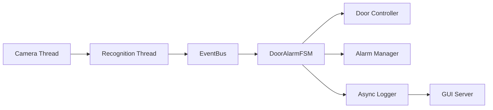
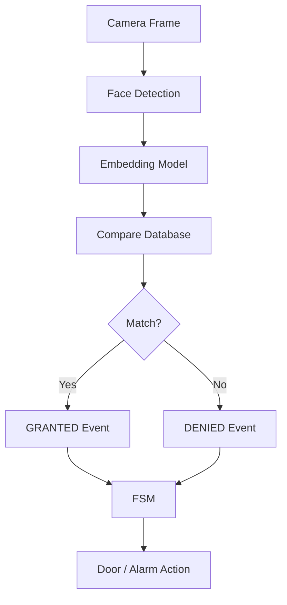
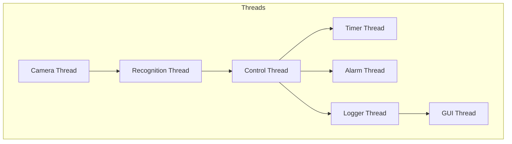
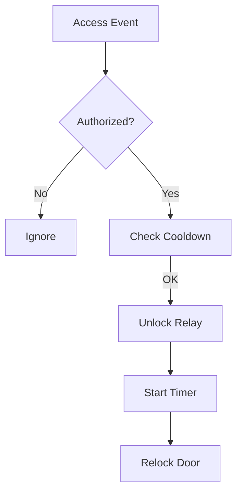
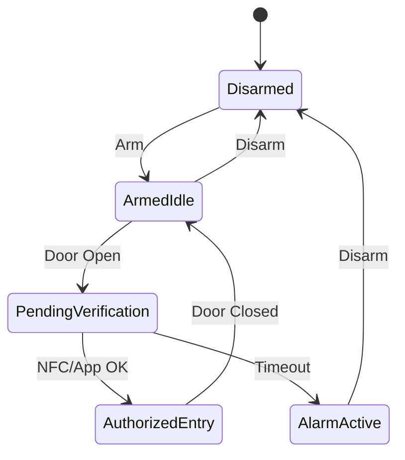
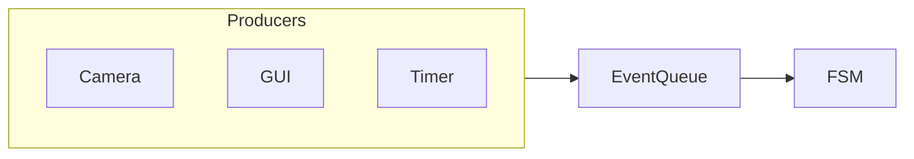

#  IoT Multi-Factor Smart Door System — Raspberry Pi 5

This project presents a secure smart door access system using IoT and multi-factor authentication. It combines multiple verification methods such as RFID, and faical recognition to ensure only authorized users can unlock the door. The system is built using raspberry pi and connected modules, enabling real-time monitoring and remote access control. By requiring more than one authentication factor, it significantly enhances security compared to traditional single-method locking systems.

A **real-time IoT-based smart door security system** combining:

- Face Recognition (OpenCV + ONNX)
- NFC based Authentication
- Door Sensor Monitoring
- FSM-based Alarm System
- Multi-threaded Event-Driven Architecture

---

#  System Overview

## Smart Door Lock
- Real-time face recognition using camera
- Relay-controlled solenoid lock
- Unlock cooldown + timer-based relocking
- Uses GStreamer (`libcamerasrc`) pipeline

## Door Alarm System
- FSM-based control logic
- Event-driven architecture
- NFC / App authorization
- Alarm trigger on unauthorized access

---

#  System Architecture

## High-Level Architecture



---

## Event Flow



---

## Multi-Threaded Design



---

## Door Control Flow



---

## FSM State Machine



---

## Event Queue



---

#  Hardware

| Component            | Notes                                      |
|----------------------|--------------------------------------------|
| Raspberry Pi 5       | 4 GB+ recommended                          |
| Pi Camera Module 3   | Connected via CSI ribbon cable             |
| 5 V relay module     | Active-HIGH; controls 12 V solenoid lock   |
| 12 V solenoid lock   | Fail-secure (locked when unpowered)        |
| 5 V / 3 A PSU        | For the Pi; relay needs its own 12 V rail  |


---

#  Wiring
```
Pi BCM17 ─── Relay IN
Pi 5V   ─── Relay VCC
Pi GND  ─── Relay GND

Relay COM ─── 12V +
Relay NO  ─── Solenoid +
```

---

#  Software Dependencies

```bash
sudo apt update
sudo apt install -y     
    cmake build-essential git \
    libgstreamer1.0-dev \
    libgstreamer-plugins-base1.0-dev \
    libgstreamer-plugins-bad1.0-dev \
    gstreamer1.0-plugins-base \
    gstreamer1.0-plugins-good \
    gstreamer1.0-plugins-bad \
    gstreamer1.0-plugins-ugly \
    gstreamer1.0-libcamera \
    gstreamer1.0-tools \
    gstreamer1.0-libav \
    libcamera-dev \
    libavcodec-dev libavformat-dev libswscale-dev \
    libgtk-3-dev libjpeg-dev libpng-dev libtiff-dev \
    libgpiod-dev

```

---

#  Project Structure

```
Project Root/
├── main.cpp
├── CMakeLists.txt
├── include/
│   ├── AccessEvent.h
│   ├── AsyncLogger.h
│   ├── CameraThread.h
│   ├── DoorController.h
│   ├── EventBus.h
│   ├── FaceRecognizer.h
│   ├── GpioPin.h
│   ├── OverrideManager.h
│   ├── RecognitionThread.h
│   ├── ThreadSafeQueue.h
│   └── FrameData.h
├── src/
│   ├── AsyncLogger.cpp
│   ├── CameraThread.cpp
│   ├── DoorController.cpp
│   ├── FaceRecognizer.cpp
│   ├── GUIServer.cpp
│   ├── RecognitionThread.cpp
│   └── DoorAlarmSystem.cpp
├── tools/
│   ├── capture_dataset.cpp
│   └── build_database.cpp
├── models/
├── dataset/
└── database/
```

---

## Build

```bash
mkdir build && cd build
cmake .. -DCMAKE_BUILD_TYPE=Release
make -j4
```


#  Workflow

## Capture Dataset
```
./CaptureDataset
# Enter a name, press 'c' ~10–20 times, then 'q'
# Repeat for each person

```

## Build Database
```
./BuildDatabase
# Produces database/embeddings.yml
```

## Run System
```
./faceid_door
# Press ESC to quit

```
The door unlocks for **3 seconds** on a confirmed match.  
A **5-second cooldown** prevents repeated triggers.
---

#  Alarm Commands

- arm
- disarm
- door_open
- door_close
- nfc_ok
- app_ok
- status
- quit

---

#  Tuning

- kMatchThreshold → accuracy
- kUnlockDurationMs → unlock time
- kCooldownMs → delay
- kDetectEvery → frame skipping

---

# Security Notes

- Not spoof-proof
- Add liveness detection
- Use non-root GPIO access

---
# Project Development Report

## Abstract
This report summarises the development journey of Team 22’s Door Intrusion Alarm System from the initial pitch to the final integrated product. The system was developed as a Raspberry Pi-based security solution that detects unauthorized door openings and responds in real time. During development, the project gradually expanded from an initial concept into a complete system combining hardware sensing, NFC-based verification, face recognition, multithreaded control logic, API support, and final integration testing.

## 1. Introduction
The aim of this project was to design and implement a Door Intrusion Alarm System using Raspberry Pi. The system was intended to monitor door activity, verify whether access was authorized, and respond immediately to suspicious events. In the original pitch, the team proposed a real-time alarm system that could detect when a door was opened and determine whether the access was valid. If the system detected unauthorized entry, it would trigger a buzzer and send notifications.

From the beginning, a key requirement was real-time performance. The system needed to respond quickly, process different events in parallel, and avoid false alarms. Because of this, the project gradually developed into a combination of hardware, software, access verification, communication functions, and team-based integration work.

## 2. Development Process

### 2.1 Initial Pitch Stage
The project began with a pitch that explained the main purpose of the system, its use cases, and the overall architecture. At this stage, the team focused on the problem definition rather than implementation details. The main concept was simple: if the door opened, the system should check whether access had been authorized; if not, it should trigger an alarm and send an alert.

### 2.2 Task Allocation and Team Planning
After the pitch, the team divided the work according to different technical areas so that development could proceed in parallel.

- **David (Tian):** API development
- **Jinyuyuan:** Main program and FSM design
- **Parth:** Camera integration and face recognition
- **Pooja:** Hardware, NFC connection, and final integration

This division made the project more manageable and allowed each team member to focus on a specialised part of the system while still contributing to the final integrated product.

### 2.3 Main Program and FSM Design
A major part of the project was the design of the main program and finite state machine. This provided the system with its overall decision-making structure. The system needed to coordinate multiple inputs, including door events, NFC access events, camera recognition results, and remote interactions. Since these events could happen at different times, the project adopted a multithreaded design rather than a simple sequential program.

### 2.4 Hardware and NFC Development
The hardware side included GPIO interrupts, switch reading, LED and buzzer control, debounce handling, NFC reader integration, and final integration support. This part was essential because reliable hardware behaviour formed the basis of the entire alarm system. NFC integration also allowed the system to distinguish authorized access from suspicious entry attempts.

### 2.5 Camera and Face Recognition Development
The camera and face recognition module added a second method of access verification and made the system more advanced than a basic alarm system. This allowed the project to include identity-based verification in addition to NFC-based access.

### 2.6 API Development
The API provided a communication layer between the core system and external interfaces. This helped the project move beyond a standalone local alarm and towards a more structured and extensible software system. It also supported later integration and final testing.

## 3. GitHub Collaboration and Integration
An important part of the project was the collaborative development workflow. Each team member completed their own assigned module and uploaded their code to GitHub. This allowed the project to be developed in parallel and kept the work organised and traceable.

After the main modules had been developed, the team merged their code into a shared main branch. This final branch represented the integrated version of the project and reflected a realistic software engineering workflow.

## 4. Final Assembly and Testing
After the code had been developed and merged, all team members participated in the final assembly of the product. This stage involved connecting the hardware components, checking the Raspberry Pi setup, and ensuring that the software modules worked together correctly.

The final product combined:
- door sensor input
- NFC reader verification
- camera and face recognition
- alarm logic
- buzzer output
- API-related communication

Once assembly was completed, the team carried out final testing to verify that:
- the door sensor could detect opening events correctly
- authorized access could be identified
- unauthorized access could trigger the alarm
- the buzzer and related response worked properly
- the complete system behaved reliably after integration

## 5. Challenges and Reflection
One of the main challenges of the project was integration. During the earlier stages, each team member focused on their own technical area, but in the final stage, all parts needed to operate together without conflicts.

Another challenge was coordinating both hardware and software at the same time. Because this was an embedded system, success depended not only on code quality, but also on stable hardware interaction, correct timing, and reliable event handling.

The project also highlighted the importance of teamwork. Clear task division improved development efficiency, but the final outcome depended on collaboration, GitHub merging, final assembly, and shared testing.

## 6. Conclusion
In conclusion, the Door Intrusion Alarm System project developed from an initial pitch idea into a fully integrated Raspberry Pi-based security product. The project started with a clear concept of real-time intrusion detection and gradually evolved into a complete system through task division, technical development, GitHub collaboration, product assembly, and testing.

Each member contributed to a different core part of the system: David developed the API, Jinyuyuan designed the main program and FSM, Parth implemented camera integration and face recognition, and Pooja worked on hardware and NFC integration. In addition, all group members took part in the final product assembly, uploaded their code to GitHub, merged their work into the main branch, and completed system testing together.
```
---


---
# Hardware Setup and Deployment Guide

## Overview
This section describes the hardware wiring, Raspberry Pi 5 setup, dependency installation, serial configuration, permissions, and build process for the access control system.

installing the image to raspberry pi5 - boot image

Raspberry Pi Imaging Utility

To install on Raspberry Pi OS, use sudo apt update && sudo apt install rpi-imager.
Download the latest version for Windows, macOS and Ubuntu from the Raspberry Pi downloads page.


(1) 1.3” Display
(2) NFC Module
(3) Joystick
(4) GPIOs breakout
(5) Battery Connector
(6) TF card slot
(7) Buzzer
(8) Pico W


2. Install Dependencies
Bash
sudo apt install -y build-essential cmake libgpiod-dev libcurl4-openssl-dev libssl-dev

4. Serial Port Configuration (Raspberry Pi 5)
Since this project uses the hardware UART (ttyAMA0 / ttyAMA10), you must disable the Linux serial console to prevent data corruption:

Run sudo raspi-config.

Navigate to Interface Options -> Serial Port.

Select No for "Would you like a login shell to be accessible over serial?".

Select Yes for "Would you like the serial port hardware to be enabled?".

Reboot your Raspberry Pi.

4. Permissions
Ensure your user has permission to access the serial and GPIO hardware:

Bash
sudo usermod -a -G dialout $USER
sudo usermod -a -G gpio $USER
(Note: You must log out and back in for group changes to take effect.)

🚀 Building the Project
Once the dependencies are installed, use the following commands to compile the system:

Bash
./build.sh


## 1. ReadPi and Raspberry Pi 5 Interfacing (NFC UID Transfer)
| Device | ReadPi Pin | RPi 5 Physical Pin | RPi 5 BCM/GPIO | Function |
| :--- | :--- | :--- | :--- | :--- |
| **ReadPi** | GPIO 0 (TX) | **Pin 10** | **GPIO 15 (RXD0)** | Serial UART connection |
| **ReadPi** | GPIO 1 (RX) | **Pin 8** | **GPIO 14 (TXD0)** | Serial UART connection |
| **Ground** | GND | **Pin 6** | **Ground** | Common Ground |

## 2. Pico W and RFID module interfacing
| Pico W Pin | NFC Module Pin | Function |
| :--- | :--- | :--- |
| **GP4** | RX | Serial UART connection |
| **GP5** | TX | Serial UART connection |

## 3. Pico W and Display interfacing
| Pico W Pin | Display Pin | Function |
| :--- | :--- | :--- |
| **GP10** | SCLK | Clock pin of SPI interface for display |
| **GP11** | DIN | MOSI (Master OUT Slave IN) data pin of SPI interface |
| **GP8** | DC | Data/Command pin of SPI interface |
| **GP9** | CS | Chip Select pin of SPI interface for display |
| **GP12** | Reset | Display Reset Pin |

## 4. Pico W and micro SD card interfacing
| Pico W Pin | microSD Card | Function |
| :--- | :--- | :--- |
| **GP18** | SCLK | Clock pin of SPI interface for microSD card |
| **GP19** | DIN | MOSI (Master OUT Slave IN) data pin of SPI interface |
| **GP16** | DOUT | MISO (Master IN Slave OUT) data pin of SPI interface |
| **GP17** | CS | Chip Select pin of SPI interface for SDcard |

## 5. Security & Feedback Interfacing (Raspberry Pi 5)
| Component | RPi 5 Physical Pin | RPi 5 BCM/GPIO | Function |
| :--- | :--- | :--- | :--- |
| **Reed Switch** | Pin 37 | **GPIO 26** | Monitor door status (0: Closed, 1: Open) |
| **Red LED** | Pin 11 | **GPIO 17** | Access Denied indicator |
| **Green LED** | Pin 15 | **GPIO 22** | Access Granted indicator |
| **Buzzer** | Pin 13 | **GPIO 27** | Alarm for Denied/Force entry |

## 6. Camera Module
| Device | Port | Connection |
| :--- | :--- | :--- |
| **Camera Module** | **CAM0** | Plugged into the Raspberry Pi 5 CAM0 port |

## 7. Joystick, Buzzer and LED Interfacing (Pico W)
| Pico W Pin | Component | Function |
| :--- | :--- | :--- |
| **GP2** | Joystick X | Analog Horizontal Input |
| **GP3** | Joystick Y | Analog Vertical Input |
| **GP22** | Joystick SW | Button Press |
| **GP14** | Buzzer | Audio Feedback |
| **GP15** | Status LED | System Status Indicator |
---
