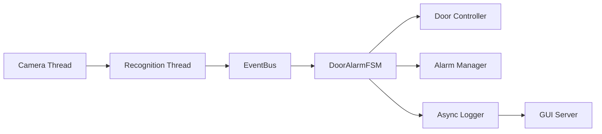
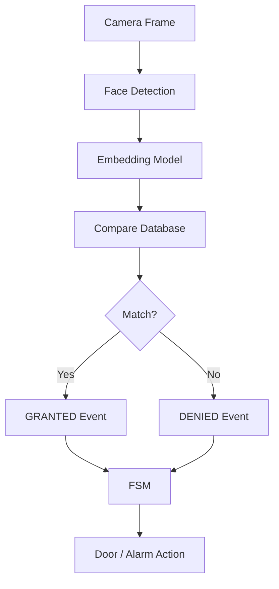
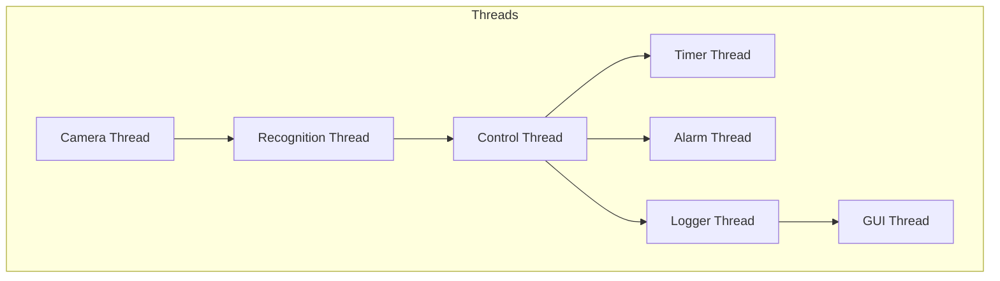
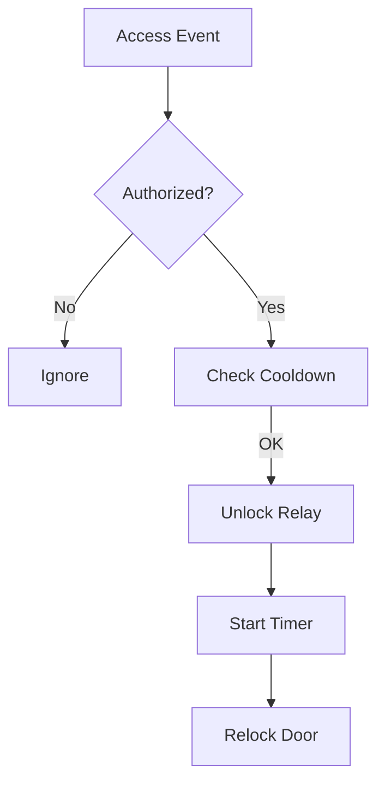
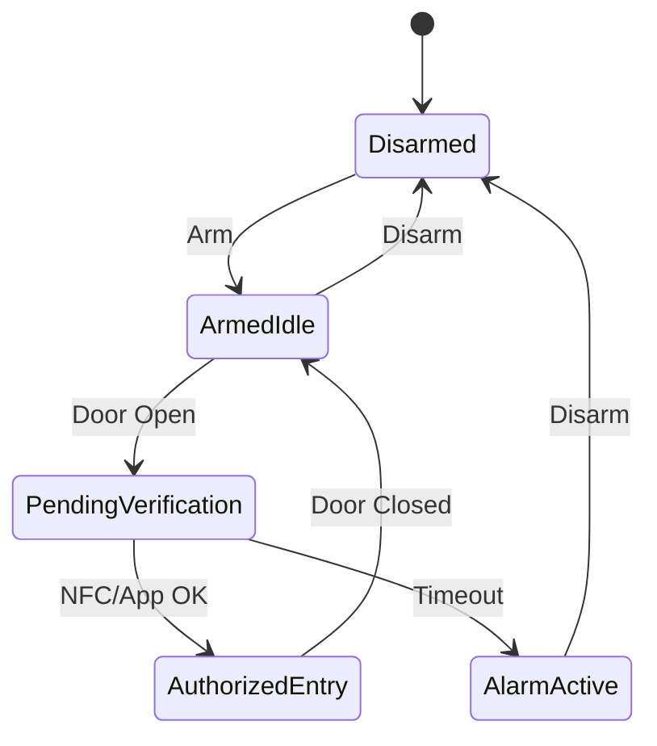
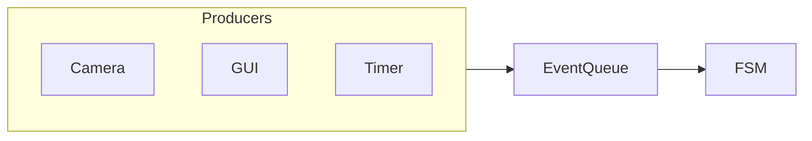

#  IoT Multi-Factor Smart Door System — Raspberry Pi 5

This project presents a secure smart door access system using IoT and multi-factor authentication. It combines multiple verification methods such as RFID, and faical recognition to ensure only authorized users can unlock the door. The system is built using raspberry pi and connected modules, enabling real-time monitoring and remote access control. By requiring more than one authentication factor, it significantly enhances security compared to traditional single-method locking systems.

A **real-time IoT-based smart door security system** combining:

- Face Recognition (OpenCV + ONNX)
- NFC based Authentication
- Door Sensor Monitoring
- FSM-based Alarm System
- Multi-threaded Event-Driven Architecture

---

#  System Overview

## Smart Door Lock
- Real-time face recognition using camera
- Relay-controlled solenoid lock
- Unlock cooldown + timer-based relocking
- Uses GStreamer (`libcamerasrc`) pipeline

## Door Alarm System
- FSM-based control logic
- Event-driven architecture
- NFC / App authorization
- Alarm trigger on unauthorized access

---

#  System Architecture

## High-Level Architecture



---

## Event Flow



---

## Multi-Threaded Design



---

## Door Control Flow



---

## FSM State Machine



---

## Event Queue



---

#  Hardware

| Component            | Notes                                      |
|----------------------|--------------------------------------------|
| Raspberry Pi 5       | 4 GB+ recommended                          |
| Pi Camera Module 3   | Connected via CSI ribbon cable             |
| 5 V relay module     | Active-HIGH; controls 12 V solenoid lock   |
| 12 V solenoid lock   | Fail-secure (locked when unpowered)        |
| 5 V / 3 A PSU        | For the Pi; relay needs its own 12 V rail  |


---

#  Wiring
```
Pi BCM17 ─── Relay IN
Pi 5V   ─── Relay VCC
Pi GND  ─── Relay GND

Relay COM ─── 12V +
Relay NO  ─── Solenoid +
```

---

#  Software Dependencies

```bash
sudo apt update
sudo apt install -y     cmake build-essential git     libgstreamer1.0-dev     gstreamer1.0-plugins-base     gstreamer1.0-plugins-good     gstreamer1.0-plugins-bad     gstreamer1.0-libcamera     libcamera-dev     libgpiod-dev
```

---

#  Project Structure

```
Project Root/
├── main.cpp
├── CMakeLists.txt
├── include/
│   ├── AccessEvent.h
│   ├── AsyncLogger.h
│   ├── CameraThread.h
│   ├── DoorController.h
│   ├── EventBus.h
│   ├── FaceRecognizer.h
│   ├── GpioPin.h
│   ├── OverrideManager.h
│   ├── RecognitionThread.h
│   ├── ThreadSafeQueue.h
│   └── FrameData.h
├── src/
│   ├── AsyncLogger.cpp
│   ├── CameraThread.cpp
│   ├── DoorController.cpp
│   ├── FaceRecognizer.cpp
│   ├── GUIServer.cpp
│   ├── RecognitionThread.cpp
│   └── DoorAlarmSystem.cpp
├── tools/
│   ├── capture_dataset.cpp
│   └── build_database.cpp
├── models/
├── dataset/
└── database/
```

---

#  Workflow

## Capture Dataset
```
./CaptureDataset
```

## Build Database
```
./BuildDatabase
```

## Run System
```
./faceid_door
```

---

#  Alarm Commands

- arm
- disarm
- door_open
- door_close
- nfc_ok
- app_ok
- status
- quit

---

#  Tuning

- kMatchThreshold → accuracy
- kUnlockDurationMs → unlock time
- kCooldownMs → delay
- kDetectEvery → frame skipping

---

# Security Notes

- Not spoof-proof
- Add liveness detection
- Use non-root GPIO access

---

```